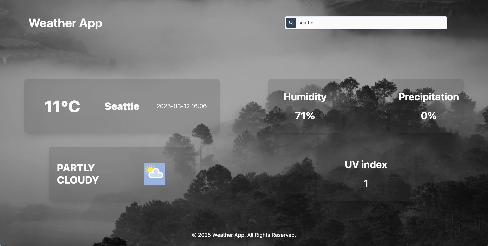

# Weather_App

A weather app that displays weather information including temperature, weather description, humidity, precipitation, and UV index for the searched city. 

### Tech Stack 
- Language: TypeScript, HTML, CSS
- Framework: React, TailWindCSS
- Weather Stack API

### Install Instructions
1. Clone this repository
2. ```cd weather-app```
3. ```npm install```
4. ```npm run dev```

### Preview 

